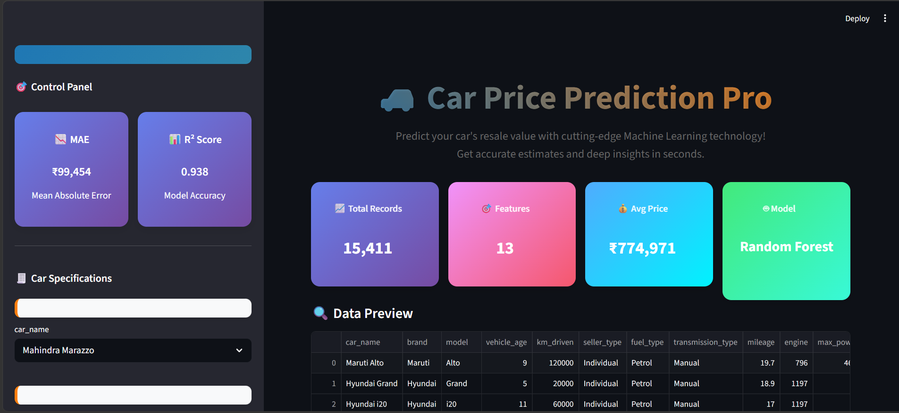

#  Car Price Prediction Pro

##  Overview

Car Price Prediction Pro is an end-to-end Machine Learning web application built using **Streamlit** that predicts the resale value of a car based on various features such as fuel type, transmission, and more.

This project demonstrates a complete ML pipeline including data preprocessing, model training, evaluation, and deployment through an interactive web interface.

---

##  Demo

[▶️ Watch Demo](./demo_video.mp4)

---

## 📸 Screenshots

---

##  Features

*  Predict car prices using Machine Learning
*  Interactive dashboard with real-time inputs
*  Model performance metrics (MAE, R² Score)
*  Data visualizations (distribution & feature importance)
*  Prediction history stored using SQLite
*  Automatic model training & loading

---

##  Tech Stack

* **Frontend:** Streamlit
* **Backend:** Python
* **ML Model:** Random Forest Regressor
* **Libraries:** Pandas, NumPy, Scikit-learn, Matplotlib, Seaborn
* **Database:** SQLite
* **Model Storage:** Joblib

---

##  Machine Learning Workflow

1. Data Loading from CSV file
2. Data Cleaning and preprocessing
3. Label Encoding for categorical features
4. Train-test split (80:20)
5. Model training using Random Forest
6. Model evaluation using MAE and R² Score
7. Prediction using user input

---

##  How to Run Locally

1. Clone the repository:
   git clone https://github.com/yourusername/car-price-prediction.git

2. Navigate to the project folder:
   cd car-price-prediction

3. Install dependencies:
   pip install requirements

4. Run the application:
   streamlit run app.py

---

##  Model Performance

*  Mean Absolute Error (MAE): ₹99,454
*  R² Score: 0.938
---

##  Author

**Afrose Fathima J**
AI & Data Science Student
📍 Chennai, India

---

##  If you like this project

Give it a ⭐ on GitHub and share your feedback!

